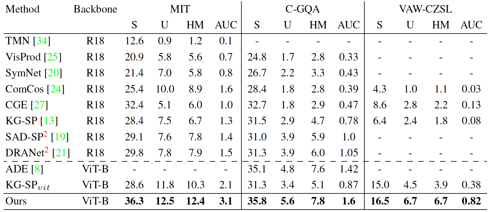

# Official Implementation for 'Unified Framework for Open-World Compositional Zero-shot Learning' in WACV 2025
[Hirunima Jayasekara](https://hirunima.github.io/),
[Nirat Saini](https://scholar.google.com/citations?hl=en&view_op=list_works&gmla=AJsN-F4kgg1kbcLx0j2dkvo5bGoQb9BU8bNEaEkiOirw72JFqU1cdNGVo3r8KTG7pq0yHTgIZ1M6jqtUUbXRAz_6YPTAeJjMwA&user=VsTvk-8AAAAJ),
[Khoi Pham](https://scholar.google.com/citations?user=o7hS8EcAAAAJ&hl=en),
[Abhinav Shrivastava](http://www.cs.umd.edu/~abhinav/)
### [Paper](https://arxiv.org/abs/2412.04083) | [Project Page](https://github.com/hirunima/OWCZSL) 
---
<p align="center">
  
</p>

## Setup

We provide an [`environment.yml`](environment.yml) file that can be used to create a Conda environment. 
```bash
conda env create -f environment.yml
conda activate owczsl
```

## Dataset
To download datasets,
```
sh download_data.sh
```

## Training
To run the model for MIT-States Dataset:
```
python train.py with cfg=config/mit-states.yml per_gpu_batchsize=32 num_freeze_layers=0 lr_transformer=3.5e-6 lr=3.6e-6 lr_cross=1e-6 k=3 offset_val=0.1 neta=0.01

```
## Evaluation

To evaluate the model for MIT-States Dataset:
```
python test.py  with cfg=config/mit-states.yml

```

### Results
Open world performance on MIT-States, C-GQA and VAW-CZSL. As evaluation matrices we refer to AUC with seen and unseen compositions with different bias terms along with HM.

<p align="center">
  
</p>

## Citation

```bibtex
@INPROCEEDINGS{jayasekara2024unified,
  author={Jayasekara, Hirunima and Pham, Khoi and Saini, Nirat and Shrivastava, Abhinav},
  booktitle={2025 IEEE/CVF Winter Conference on Applications of Computer Vision (WACV)}, 
  title={Unified Framework for Open-World Compositional Zero-Shot Learning}, 
  year={2025},
  volume={},
  number={},
  pages={2706-2714}}
```
