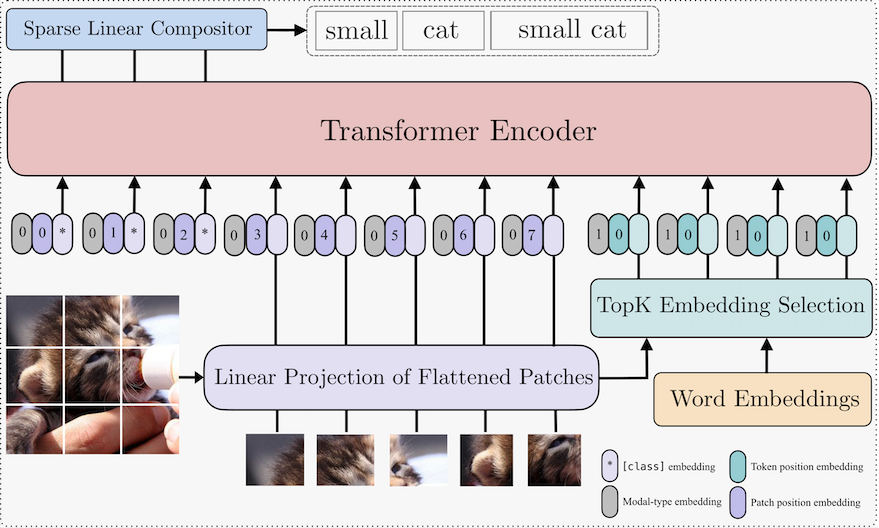

# Official Implementation for 'Unified Framework for Open-World Compositional Zero-shot Learning', WACV 2025
[Hirunima Jayasekara](https://hirunima.github.io/),
[Nirat Saini](https://scholar.google.com/citations?hl=en&view_op=list_works&gmla=AJsN-F4kgg1kbcLx0j2dkvo5bGoQb9BU8bNEaEkiOirw72JFqU1cdNGVo3r8KTG7pq0yHTgIZ1M6jqtUUbXRAz_6YPTAeJjMwA&user=VsTvk-8AAAAJ),
[Khoi Pham](https://scholar.google.com/citations?user=o7hS8EcAAAAJ&hl=en),
[Abhinav Shrivastava](http://www.cs.umd.edu/~abhinav/)

---
<p align="center">
  
</p>

## Instalation
```
python=3.9.17
pytorch=1.13.1
```

## Dataset
To download datasets,
```
sh download_data.sh
```
To run the model for MIT-States Dataset:
Training:
```
python train.py with cfg=config/mit-states.yml per_gpu_batchsize=32 num_freeze_layers=0 lr_transformer=3.5e-6 lr=3.6e-6 lr_cross=1e-6 k=3 offset_val=0.1 neta=0.01

```
*This is a draft version of the final code. We will be cleaning up the code in following days.

